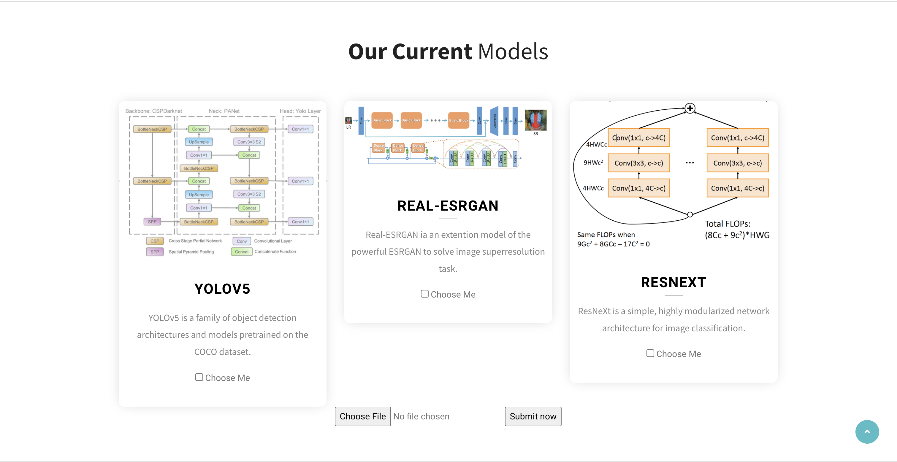

# Intelligent-Backend

This is a backend that integrate several AI models, aiming at enableing developers to quickly get AI-processsed result by simply calling the backend API command. A website is developed to visually demonstrate the functionality and how to use it.

## How to use it
### From Website

The initial interface is as belows:



You can multi-select the models you like, choosing the file that you want to process, and click submit.

Then you will be direct to the result page:


Each block represents the processed result of one model that you selected.  **Request The Backend Yourself** section tells you the API command if you want to request the backend directly. **Viewing Image** section gives you the processed result of your image. **Viewing Result** section presents the Json response message if you request the backend directly, which consists of three keys: **Latency, Result, and Download link**. The download link allows you to download the processed image directly.

**Considering the big running cost of big language models and video models, we haven't enable text and video file submit. But we will definitely do it when we make our backend more scalable.**

### From command line API request

1. **First, make sure you have [HTTPie](https://httpie.org/) installed.**

To install, for linux and windows WSL:

```bash
sudo apt-get install httpie
```

For macOS:

```bash
brew install httpie
```

2. **Then you can request the backend directly:**

```bash
http --form POST http://localhost:8000/api/v1/{model_name}/ image=@{your_image_path}
```

where {model_name} is the model name that you choose, {your_image_path} is the relative or absolute path to the image that you want to process.

You will get a JSON response like below:

```python
{
  'download_file_link': '/yolo/download/', 
 	'latency': 'Speed: 2.6ms pre-process, 804.0ms inference, 9.1ms NMS per image'
	'result': '1 bowl, 2 chairs, 1 couch, 3 potted plants, 5 books, 5 vases, ', 
}
```


## Current Support Models

* Image Detection: Yolov5
* Image Segmentation: segFormer
* Image Superresolution: Real-ESRGAN
* Image Classification: ResNext


## For future backend developers: How to add more models

We have made it easy for future backend developers to add in more models. You do not need to read any code we wrote. All you need to do is using Flask framework, creating three API url endpoints in ./backend/api folder.

Below we give an example of how to add in a model called my_awesome_model.

1. create a new python file in ./backend/api folder. Name it whatever you like. Also create a folder to store your own model.

   

2. In my_awesome_model.py, you should have three url endpoint:

   * /api/v1/{model_name}/:

     This is the main url that deals with POST image request. It will receive post request that post an image (image name is guaranteed to be "1.jpg"). It should return a json, which has four keys: "latency", "result", "download_file_link", "upload_file_link".   Where "download_file_link" and "upload_file_link" just need to be filled with two endpoints that stated below.

   * /{model_name}/download/:

     It is the url endpoints that allow users to download the processed image. We recommand using `flask.send_file` function, which takes the `processed_file_path` as argument.  You can store the processed image anywhere in your model folder, just need to provide the path to `flask.send_file` as argument.

   * /{model_name}/upload/:

     It is the url endpoints that upload processed image in order to allow showing processed image in the website.  We recommand using `flask.send_from_directory` function. The argument is very similar to `flask.send_file` function,  the only difference is that it seperate the `processed_file_path` into `processed_file_directory` and `file_name.`

     

3.  Then add in the function that process /api/v1/{model_name}/ endpoints into `__init__.py` in backend/api folder.

   

4. At this point you are finished with creating an Rest API for your model. If you want to add your model to the UI interface of the website, please contact the author neymar@umich.edu.

